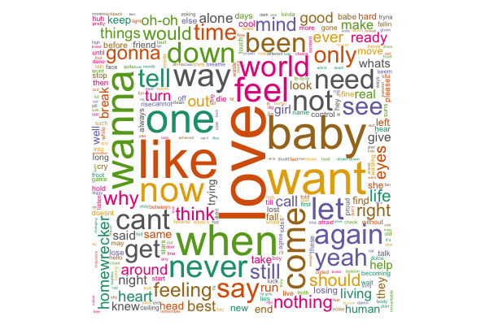

# NLP-learning
A look at my progress as continue to learn more about natural language processing (NLP).

1. First, I'm checking out something I've been curious about for a long time: do my favorite songs have similar messages? 

I chose 33 songs from my 6 favorite artists, and I cleaned the data, removing any stop words (pronouns like "i"/"you"/"he"; articles like "a"/"the"/"an"; conjunctions; etc- basically words that do not add meaning) and cleaning up formatting. Finally, I was able to put these words in a document term matrix and get the word cloud in R.

# Word Cloud before (I realized I had a LOT of stopwords left to filter out!)

# Word Cloud after filtering stop words

2. If there is a certain theme that many of Is there a type of theme or motif that I am drawn to? In other words, What if I were to get another artist's greatest hits and generate a word cloud? If the results are similar, I would expect to enjoy the music, and if not, I might expect to not like it.
